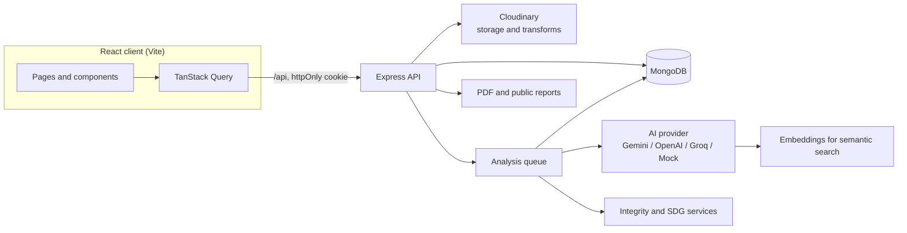

<div align="center">

# ImpactLens AI

**Turn raw field photos and videos into searchable, verifiable impact evidence.**

ImpactLens helps NGOs, CSR teams and public agencies organise project media, understand it with AI, check it for integrity, and publish impact reports where every claim links back to its source.


</div>

## Why ImpactLens

Impact teams collect thousands of field photos, but they end up scattered across phones and shared drives with no context. When it's time to report, someone scrolls for hours and picks the best-looking pictures. No one can say what was actually documented, what is missing, or whether a photo was reused from another project.

ImpactLens treats every photo and video as **evidence**:

1. **Understand.** Gemini describes each asset and separates what it *observed* from what it *inferred*, with calibrated confidence.
2. **Find.** Search in plain language ("kids helping with saplings") using semantic embeddings, not just file names.
3. **Verify.** Integrity checks flag reused, edited or out-of-place media before it reaches a report.
4. **Report.** Reports, PDFs and public share pages trace every statement back to the media that supports it.

## Features

| | |
|---|---|
| **AI media analysis**<br>Schema-constrained Gemini output: description, activities, objects, environmental signals and tags, each with its own confidence. Observed and inferred statements are kept apart, and confidence is capped at 95% so it never reads as proof. Videos are analysed as whole clips, with key frames extracted at 10%, 50% and 90% of the clip. |  |
| **Semantic evidence search**<br>Every asset is embedded with `gemini-embedding-001`. Queries are ranked by meaning and blended with keyword matches, and each result shows why it matched. Filters cover evidence type, activity, place, date and confidence. |  |
| **Before / after comparison**<br>Suggested pairs from the same site, an interactive slider, and an AI-detected change score with observed differences. With Cloudinary, a side-by-side composite image is generated for reports. |  |
| **Integrity review (anti-greenwashing)**<br>A SHA-256 hash and a perceptual dHash catch exact and near-duplicate reuse, including across projects. The checks also flag editing software, missing camera metadata, capture dates outside the project window, and GPS beyond the site radius. Every asset gets a 0–100 score. Flags are signals for human review, not verdicts. |  |
| **UN SDG alignment**<br>A transparent rules table maps AI-detected activities and signals to the Sustainable Development Goals and records the matched terms. The results are worded as alignment, never as a measured contribution. |  |
| **Timeline, map and coverage**<br>Evidence is grouped by month and plotted on a map. Each location is labelled by how it's known: GPS-verified, user-provided or AI-estimated. Coverage tracks the expected evidence categories and suggests what to capture next. |  |
| **Traceable reports**<br>Reports are generated from the evidence database: KPIs, coverage, insights, integrity, SDGs and an AI-written story and campaign copy. They export to PDF, or publish as a sanitised public page with a random share link. |  |

Also included: role-based access (admin, project manager, viewer), a `Ctrl+K` command palette, a live capture context on sign-in (device location and local time), and an accessible, responsive UI. Core pages are checked against WCAG 2 A/AA with axe.

## Architecture



**Upload pipeline.** Each upload goes through these steps:

1. The file signature is checked.
2. The file is stored in Cloudinary, which returns EXIF and a perceptual hash. It falls back to local disk when Cloudinary isn't configured.
3. SHA-256, dHash and camera metadata are recorded.
4. The asset is queued as `PENDING` and analysed by the provider.
5. Its embedding is stored and it moves to `COMPLETED`.

Failures keep the asset, mark it `FAILED` and can be retried. The Gemini provider paces requests, rotates across a model pool, and parks models that hit their daily quota.

More detail: [architecture](docs/architecture.md) · [AI pipeline](docs/ai-pipeline.md) · [API reference](docs/api.md) · [OpenAPI spec](docs/openapi.yaml)

## Tech stack

| Layer | Technology |
|---|---|
| Frontend | React 18, TypeScript, Vite 6, Tailwind CSS v4, TanStack Query v5, Zustand, React Router, React Hook Form + Zod, Radix UI, Leaflet |
| Backend | Node.js 20, Express 4, Mongoose 8, Multer, Sharp, PDFKit, Pino, Helmet |
| AI | Google Gemini (vision, video, text), `gemini-embedding-001`. OpenAI, OpenRouter and Groq adapters; offline mock provider |
| Media | Cloudinary (EXIF, phash, `g_auto` thumbnails, video frames, composites) with local-disk fallback |
| Testing | Jest + mongodb-memory-server, Vitest + Testing Library + MSW, Playwright + axe-core |
| Deployment | Render (API), Vercel (client), MongoDB Atlas, Docker |

## Getting started

### Prerequisites

- Node.js 20+ and npm
- MongoDB, either local or [Atlas](https://www.mongodb.com/atlas)
- Optional: a [Gemini API key](https://aistudio.google.com/apikey) and a [Cloudinary](https://cloudinary.com) account. Without them the app runs in offline mock mode.

### 1. Install

```bash
git clone https://github.com/Chirag240105/ImpactLens-AI.git
cd ImpactLens-AI
npm install            # installs client, server and shared workspaces
cp .env.example .env   # then edit MONGODB_URI, JWT_SECRET and optional keys
```

### 2. Load demo data

```bash
cd server
npm run seed:real      # 28 openly licensed field photos, analysed with your AI provider
# or
npm run seed           # synthetic offline fixture (no API keys needed)
```

### 3. Run

```bash
# terminal 1: API on http://localhost:5000
cd server && npm run dev

# terminal 2: web app on http://localhost:3000 (proxies /api to :5000)
cd client && npm run dev
```

Sign in with one of the seeded accounts:

| Role | Email | Password |
|---|---|---|
| Project manager | `manager@impactlens.demo` | `Manager123!` |
| Admin | `admin@impactlens.demo` | `Admin123!` |
| Viewer (read-only) | `viewer@impactlens.demo` | `Viewer123!` |

> Change these passwords before sharing a deployment.

## Configuration

All settings live in `.env` at the repository root. See [`.env.example`](.env.example) for the full list.

| Variable | Purpose |
|---|---|
| `MONGODB_URI` | **Required.** MongoDB connection string |
| `JWT_SECRET` | **Required.** Session signing secret; use a long random value |
| `GEMINI_API_KEY` | Enables Gemini analysis, comparison, stories and semantic search |
| `AI_PROVIDER` | `gemini`, `openai`, `groq` or `mock` (auto-selects Gemini when a key is present) |
| `GEMINI_MODELS`, `GEMINI_RPM` | Optional model pool and request pacing for free-tier keys |
| `CLOUDINARY_CLOUD_NAME` / `_API_KEY` / `_API_SECRET` | Media storage and transforms. The cloud name is the lowercase ID on the Cloudinary dashboard |
| `CLIENT_URL`, `PUBLIC_REPORT_BASE_URL` | Allowed browser origin and public share-link base |
| `COOKIE_SAMESITE`, `TRUST_PROXY` | Cookie policy and proxy hops for hosted deployments |
| `MAX_UPLOAD_MB`, `RATE_LIMIT_*` | Upload size and rate limits |

`GET /api/health` and **Settings → Service status** in the app show which services are connected.

## Scripts

| Where | Command | Description |
|---|---|---|
| `server/` | `npm run dev` / `npm start` | Start the API (watch mode / production) |
| `server/` | `npm run seed:real` | Import the real demo dataset (`--reset`, `--reanalyze` supported) |
| `server/` | `npm run seed` / `npm run seed:reset` | Load or reset the synthetic fixture |
| `server/` | `npm test` / `npm run test:coverage` | API, integrity and provider tests |
| `server/` | `npm run lint` / `npm run smoke` | ESLint and end-to-end API smoke check |
| `client/` | `npm run dev` / `npm run build` | Dev server / type-check and production build |
| `client/` | `npm test` / `npm run test:e2e` | Unit tests / Playwright E2E with accessibility checks |

## Testing

- **API:** Jest integration tests against an in-memory MongoDB. They cover auth, RBAC, uploads, search, integrity scoring, SDG alignment, reports, public sharing and the Gemini provider's retry and quota handling.
- **Client:** Vitest and Testing Library with MSW-mocked APIs. They cover forms, the auth store, evidence components and integrity/SDG views.
- **End to end:** Playwright walks the full flow from sign-in through upload, search, compare, report and public link. A smoke spec checks the core pages for layout overflow and WCAG 2 A/AA violations with axe.

```bash
cd server && npm test
cd client && npm test && npm run test:e2e
```

GitHub Actions runs two pipelines ([`.github/workflows`](.github/workflows)). The client pipeline runs lint, type-check, unit tests, the production build and the Playwright E2E suite. The server pipeline runs lint and the Jest tests with coverage.

## Deployment

The recommended free-tier setup is **MongoDB Atlas → Render (API) → Vercel (client)**:

- `render.yaml` provisions the API.
- `client/vercel.json` proxies `/api` so the session cookie stays same-site.

A root-context `server/Dockerfile` is also provided. The step-by-step guide is in [docs/deployment.md](docs/deployment.md).

## Project structure

```
ImpactLens-AI/
├── client/                 React + TypeScript SPA
│   ├── src/api/            typed endpoints, query keys, queries and mutations
│   ├── src/components/     UI kit, evidence, report and chart components
│   ├── src/pages/          dashboard, projects, evidence, compare, integrity, reports
│   └── e2e/                Playwright specs
├── server/                 Express API
│   ├── routes/ controllers/ middleware/ models/
│   ├── services/           ai, cloudinary, integrity, sdg, search, report
│   ├── jobs/               media analysis queue
│   ├── utils/              seeders, EXIF, smoke test
│   └── tests/              Jest suites
├── shared/                 enums and SDG rules shared by client and server
├── docs/                   architecture, API, AI pipeline, deployment, demo script
└── DESIGN.md               design system and tokens
```

## Responsible AI

- **Observed vs inferred.** *Observed* is only what is visible. *Inferred* is interpretation, phrased as "may" or "likely". Claimed outcomes come from human project records, never from the model.
- **Confidence is labelled, not hidden.** Every AI value shows its confidence and model, and confidence is capped below certainty.
- **Location provenance.** AI-estimated places never override GPS or user-entered locations, and each location is labelled by its source.
- **Human review.** Integrity flags and AI comparisons are shown as "AI-detected" signals. Reports carry a verification disclaimer, because visual AI alone does not prove real-world impact.

## Demo dataset credits

The real demo dataset is 28 photographs from [Wikimedia Commons](https://commons.wikimedia.org), used under their Creative Commons licences. Each asset stores its author, licence and source link, and these are shown in the evidence panel. The demo projects are illustrations built from public photos; they are not real NGO programmes.

## Team

| Member | Focus |
|---|---|
| **Chirag** | Backend architecture, AI integration |
| **Chiranjeet** | Frontend, UX and design system |
| **Avnish** | Media intelligence, timeline, analysis jobs |
| **Atharv** | Reports, testing, deployment and docs |

## License

Released under the MIT License.
