# ImpactLens AI

**Raw field media → AI understanding → evidence search → comparison → traceable impact reports.**

ImpactLens helps NGOs, governments, and sustainability teams organize project photos and videos into searchable evidence, track what is documented, and generate reports that link observations to source media.

Features: JWT auth and project roles; project/media metadata; Cloudinary adapter; offline mock analysis; async processing; keyword search; timeline, locations and coverage; before/after comparison; insight traces; report/story/campaign endpoints; public report DTOs.

## Backend status dashboard

| Module | Status | Note |
|---|---|---|
| Config, security, logging | 🟡 Partial | Typed env config, CORS, helmet, rate limit and request IDs; log integration and full hardening need review. |
| Mongo models | ✅ Done | Six timestamped schemas and core indexes. |
| Auth and RBAC | 🟡 Partial | JWT/register/login and owner checks; open registration and organization membership are demo-level. |
| Projects | ✅ Done | CRUD, paging, archiving and access check. |
| Media / Cloudinary | 🟡 Partial | Cloudinary upload with EXIF + perceptual hash, smart-crop (`g_auto`) thumbnails, video frame URLs and before/after composites; startup credential check with a local-disk fallback. Real Cloudinary uploads still need a valid cloud name to verify. |
| Queue / AI | ✅ Done | Gemini vision with schema-constrained JSON (observed vs inferred, calibrated confidence), two-image comparison, evidence-grounded story/campaign; retries and model fallback. The in-process queue is not multi-replica durable. |
| Search | 🟡 Partial | Mongo keyword filtering; no semantic ranking or vector search. |
| Analysis / insight | 🟡 Partial | Timeline, coverage, heuristic pairs, mocked comparison and evidence trace. |
| Dashboard | 🟡 Partial | Aggregation-backed project KPIs; broader analytics/cache work remains. |
| Reports / PDF | 🟡 Partial | Structured reports, story/campaign, simple PDFKit export, sanitized public fetch; visual polish remains. |
| Seed / smoke | ✅ Done | `npm run seed:real` imports 28 openly licensed Wikimedia Commons field photos (real dates, locations, attribution) and analyzes them; `npm run seed` stays the synthetic test fixture. |
| Tests / CI | 🟡 Partial | Nine API tests, coverage, lint, and full mock-mode smoke pass; real provider smoke remains. |
| Docs / deployment | 🟡 Partial | API, OpenAPI, collection, architecture and deployment docs; production behavior unverified. |
| Frontend (client) | ✅ Done | React 18 + TypeScript + Tailwind v4 SPA covering the full judge flow; design system in [DESIGN.md](DESIGN.md); Vitest, Playwright E2E and axe checks. See [client/README.md](client/README.md). |

## Architecture diagrams

### System architecture

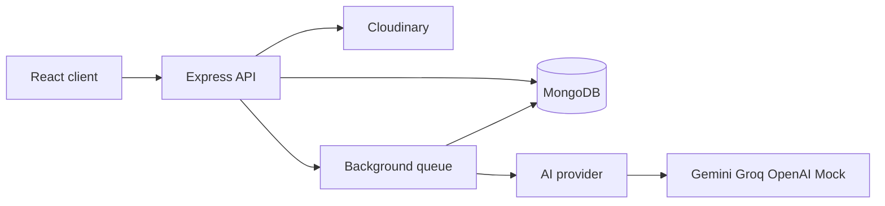

Caption: The API persists metadata and dispatches media analysis to a replaceable provider.

### Layered backend

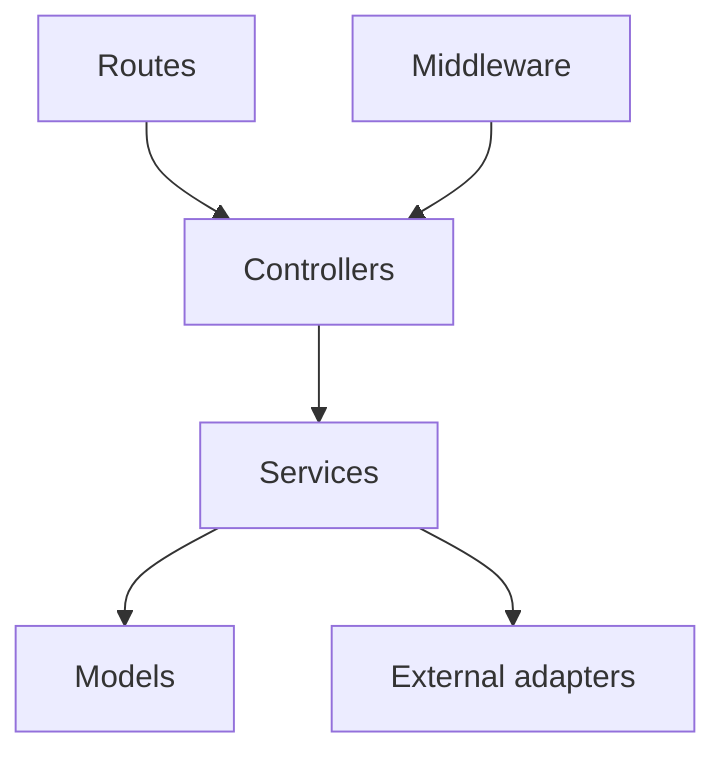

Caption: Request handling stays above business logic, persistence, and SDK adapters.

### Folder structure

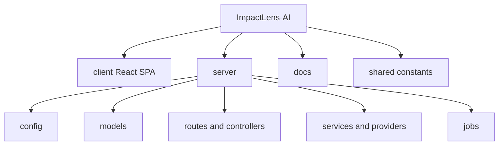

Caption: Backend modules, docs, and shared enums are separated from the client workspace.

### Upload and analysis sequence

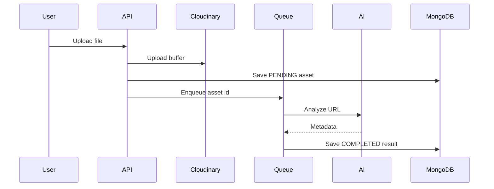

Caption: Analysis runs after the upload response and leaves the source record available on failure.

### Processing states

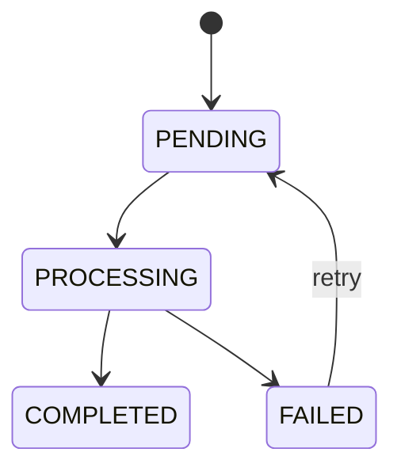

Caption: Failed work can be retried without deleting the media asset.

### Collections

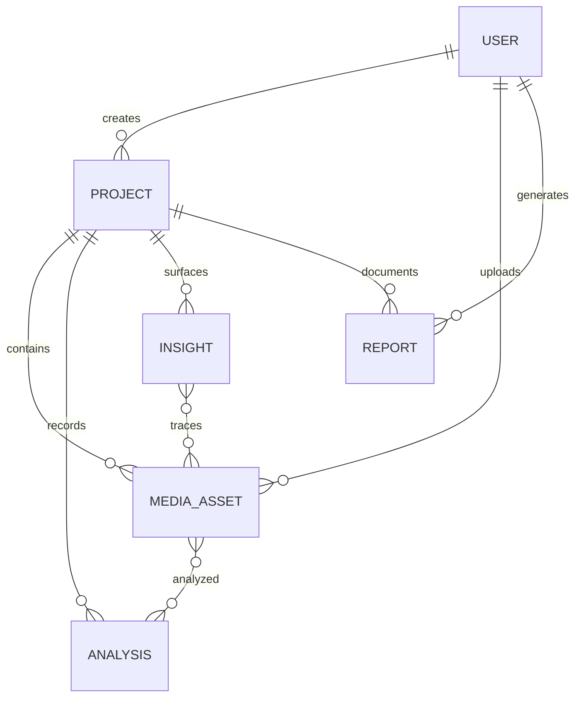

Caption: Analyses, insights, and reports reference project evidence for traceability.

### Search flow

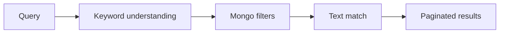

Caption: Search is currently keyword-based; semantic/vector ranking is not enabled.

### Before/after comparison

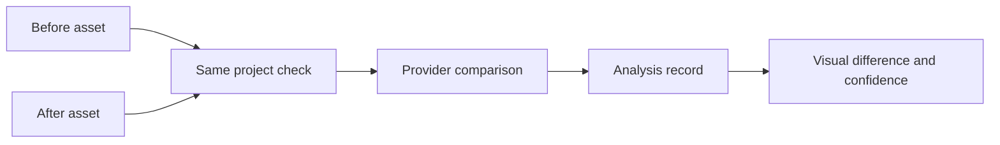

Caption: Returned differences are model observations, not measured proof of impact.

### Evidence trace

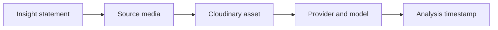

Caption: Trace endpoints link insight text to source asset metadata and AI provenance.

### Evidence coverage and gaps

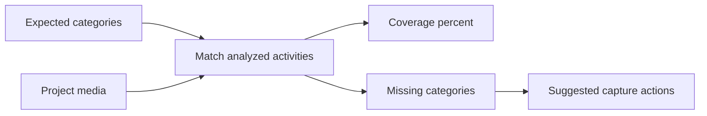

Caption: Coverage uses configured categories and flags missing follow-up evidence.

### Reports and public sharing

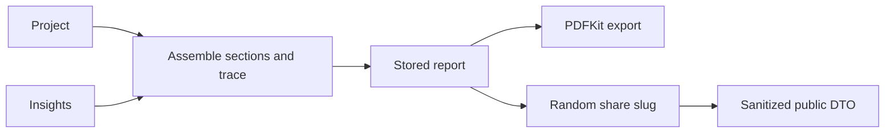

Caption: Public shares omit internal user details and are cacheable for a short period.

### Auth and RBAC

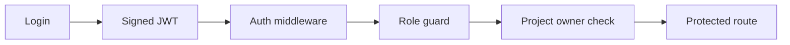

Caption: Administrative access is global; manager access is owner-scoped; viewers read only.

### Judge demo flow

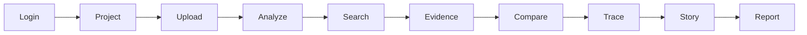

Caption: The intended walkthrough ends in a report whose statements link back to evidence.

## API reference

All endpoints and roles are listed in [docs/api.md](docs/api.md). Base URL: `/api`; protected calls use `Authorization: Bearer <JWT>`.

| Method | Path | Auth / role | Description |
|---|---|---|---|
| GET | `/health` | Public | API/dependency status |
| POST | `/auth/register` | Public | Register; first account is ADMIN |
| POST | `/auth/login` | Public | Authenticate and issue JWT |
| GET | `/auth/me` | User | Current safe user DTO |
| POST | `/auth/logout` | User | Logout acknowledgement |
| GET | `/projects` | User | Paginated project list |
| POST | `/projects` | Manager | Create project |
| GET | `/projects/:id` | User | Read project |
| PATCH | `/projects/:id` | Manager | Update project |
| DELETE | `/projects/:id` | Manager | Archive project |
| POST | `/projects/:id/analyze` | Manager | Queue project analysis |
| GET | `/projects/:id/processing-status` | User | Job counts by state |
| GET | `/projects/:id/dashboard` | User | Project KPIs |
| GET | `/projects/:id/timeline` | User | Timeline groups |
| GET | `/projects/:id/locations` | User | Location counts and sources |
| GET | `/projects/:id/coverage` | User | Evidence coverage and gaps |
| GET | `/projects/:id/comparisons` | User | Saved comparisons |
| GET | `/projects/:id/pair-suggestions` | User | Suggested before/after pairs |
| GET | `/projects/:id/insights` | User | List insights |
| POST | `/projects/:id/insights/generate` | Manager | Generate insights |
| GET | `/projects/:id/reports` | User | Paginated project reports |
| POST | `/media/sign` | Manager | Direct signing endpoint (501 currently) |
| POST | `/media/upload` | Manager | Multipart media upload |
| GET | `/media` | User | Paginated media list |
| GET | `/media/:id` | User | Read authorized asset |
| PATCH | `/media/:id` | Manager | Correct asset metadata |
| DELETE | `/media/:id` | Manager | Delete asset and Cloudinary source |
| POST | `/media/:id/analyze` | Manager | Retry analysis |
| GET | `/search` | User | Search project evidence |
| POST | `/analysis/compare` | User | Compare before/after media |
| GET | `/insights/:id/trace` | User | Trace insight source evidence |
| GET | `/dashboard/overview` | User | Org/project overview |
| POST | `/reports/generate` | Manager | Generate structured report |
| POST | `/reports/story` | Manager | Generate impact story |
| POST | `/reports/campaign` | Manager | Generate campaign text |
| GET | `/reports/:id` | User | Read report |
| GET | `/reports/:id/pdf` | User | Download PDFKit report |
| PATCH | `/reports/:id/publish` | Manager | Publish report share link |
| GET | `/reports/public/:slug` | Public | Sanitized shared report |

## Setup and run

Prerequisites: Node 20+, npm, MongoDB (local or hosted). Copy `.env.example` to `.env` and set `MONGODB_URI` and `JWT_SECRET`. AI and Cloudinary may remain unset for mock/demo mode.

```bash
cd server
npm install
npm run dev
npm run seed        # synthetic offline fixture (tests)
npm run seed:real   # real openly licensed photos + AI analysis (demo)
npm test
npm run smoke
```

Frontend: `cd client && npm install && npm run dev`, then open http://localhost:3000 (Vite proxies `/api` to the server on :5000). `npm run build` type-checks and builds to `client/dist/`; `npm test` and `npm run test:e2e` run the client suites. Details in [client/README.md](client/README.md).

The demo seed prints credentials: `admin@impactlens.demo / Admin123!`, `manager@impactlens.demo / Manager123!`, `viewer@impactlens.demo / Viewer123!`. Change these before any shared deployment.

| Variable | Required | Purpose | Example |
|---|---|---|---|
| `PORT` | No | HTTP port | `5000` |
| `NODE_ENV` | No | Runtime mode | `development` |
| `MONGODB_URI` | Yes | Mongo connection | `mongodb://localhost:27017/impactlens` |
| `JWT_SECRET` | Yes | Token signing secret | `replace_with_random_secret` |
| `JWT_EXPIRES_IN` | No | Token lifetime | `7d` |
| `CLOUDINARY_CLOUD_NAME` | No | Media cloud | empty |
| `CLOUDINARY_API_KEY` | No | Media API key | empty |
| `CLOUDINARY_API_SECRET` | No | Media API secret | empty |
| `CLOUDINARY_MODE` | No | `auto` uses configured Cloudinary; `mock` uses placeholder URLs | `auto` |
| `AI_PROVIDER` | No | Provider selection | `mock` |
| `AI_API_KEY` | No | Provider key | empty |
| `AI_MODEL` | No | Provider model | empty |
| `CLIENT_URL` | No | Allowed browser origin | `http://localhost:3000` |
| `PUBLIC_REPORT_BASE_URL` | No | Share URL base | `http://localhost:3000/reports` |
| `MAX_UPLOAD_MB` | No | Upload size limit | `50` |
| `RATE_LIMIT_WINDOW_MS` | No | Rate window | `900000` |
| `RATE_LIMIT_MAX` | No | General request cap | `200` |
| `RATE_LIMIT_ACTION_MAX` | No | Upload/analysis/generation budget per window (login has its own failed-attempt limit) | `120` |
| `COOKIE_SAMESITE` | No | Session cookie policy: `lax` for same-site deploys, `none` for a cross-site API (HTTPS) | `lax` |
| `SESSION_MAX_AGE_MS` | No | Session cookie lifetime | `604800000` |

Docker: `cd server && docker compose up --build`. Scripts: `npm start`, `npm run test:coverage`, `npm run lint`, `npm run seed:reset`, `npm run smoke`.

## ✅ Completed work checklist

- [x] Express app/server separation, typed config, Mongo connector, health route.
- [x] User, project, media, analysis, insight, report schemas and shared enums.
- [x] JWT auth, password hashing, role middleware, project owner checks.
- [x] Project CRUD/archive, media CRUD, paginated query helper, upload queue and retry path.
- [x] Mock AI metadata, project timeline, locations, coverage/gaps, comparison persistence, insight trace, report generation/public sanitization.
- [x] API docs, partial OpenAPI spec, Postman collection, Docker files and CI workflow.
- [x] API integration tests pass (9 tests), coverage run passes, and ESLint passes.
- [x] Full `npm run smoke` passed against the seeded API in mock AI / mock Cloudinary mode.
- [x] Gemini analysis verified on real photos and uploads.
- [ ] Real Cloudinary upload smoke remains unverified (needs the correct cloud name).

## 🛠️ Manual work still required

- Create/rotate production JWT, MongoDB, Cloudinary, and AI credentials. Configure provider keys outside source control.
- Confirm Cloudinary folder/preset behavior, upload/delete, metadata/EXIF, video preview, and transformed thumbnail behavior.
- Replace the Wikimedia demo dataset with the NGO's own project photos and videos when available.
- Implement direct signed upload, robust file signature detection, video frame extraction, and a durable distributed job queue.
- Add branded report layout, charts, images, and evidence trace table to the current basic PDFKit export.
- Configure production environment, Atlas network allowlist/backups, frontend CORS, domain/share route, and deployment.
- Verify public-report privacy/legal basis, retention rules, real-provider quality, rate limits, and performance under load.
- Set up Atlas Vector Search only if semantic retrieval is later implemented; it is currently unused.

## Known limitations and assumptions

With `AI_PROVIDER=mock`, MockProvider supplies deterministic demonstration labels, not computer vision (Gemini is used whenever a key is configured). Current search is keyword matching; pairing and coverage are heuristics. The queue is in-process and not safe as a multi-replica durable queue. Without Cloudinary, media is stored on the API server's disk and videos can't be frame-analyzed. Public registration assigns the first account ADMIN and subsequent accounts VIEWER. PDF export has a basic layout; signing, video frame extraction, advanced filtering, cache invalidation, and malformed AI response repair are incomplete.

## AI trust principle

**Observed** means a visual description directly returned by AI. **Inferred** means an interpretation. **Claimed** is reserved for human-supplied project records. The schema separates observed/inferred strings, confidence is labelled as AI confidence, comparison language says “AI-detected visual difference,” and report content includes a verification disclaimer. Visual AI alone does not verify real-world impact.

## Team ownership and frontend integration

| Owner | Area |
|---|---|
| Chirag | Backend, AI architecture and integration |
| Chiranjeet | Frontend and UX |
| Avnish (listed as Avani in team docs) | Media intelligence, timeline, analysis and jobs |
| Atharv | Reports, tests, deployment and product docs |

Send `Authorization: Bearer <token>` on protected requests. Lists use `page` and `limit`; responses follow `{success,data,meta}`. Login: `POST /api/auth/login`. Projects screen: `GET /api/projects`; evidence screen: `GET /api/search?q=plantation&projectId=...`; timeline: `GET /api/projects/:id/timeline`; dashboard: `GET /api/projects/:id/dashboard`; report builder: `POST /api/reports/generate` with `{ "projectId":"..." }`. See [API contracts](docs/api.md).

## Judge Q&A

- **Why not Drive?** ImpactLens attaches AI labels, project context, timelines, comparisons, and traceable reports to the media.
- **Can AI hallucinate?** Yes. Every observation remains linked to its source and is not represented as proof.
- **What proves impact?** Visual evidence supports review; independent measurements and project records establish outcomes.
- **How does it scale?** Mongo stores metadata and media is delegated to Cloudinary; replace the local queue before horizontal scaling.
