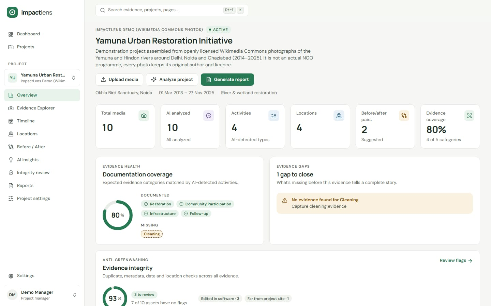
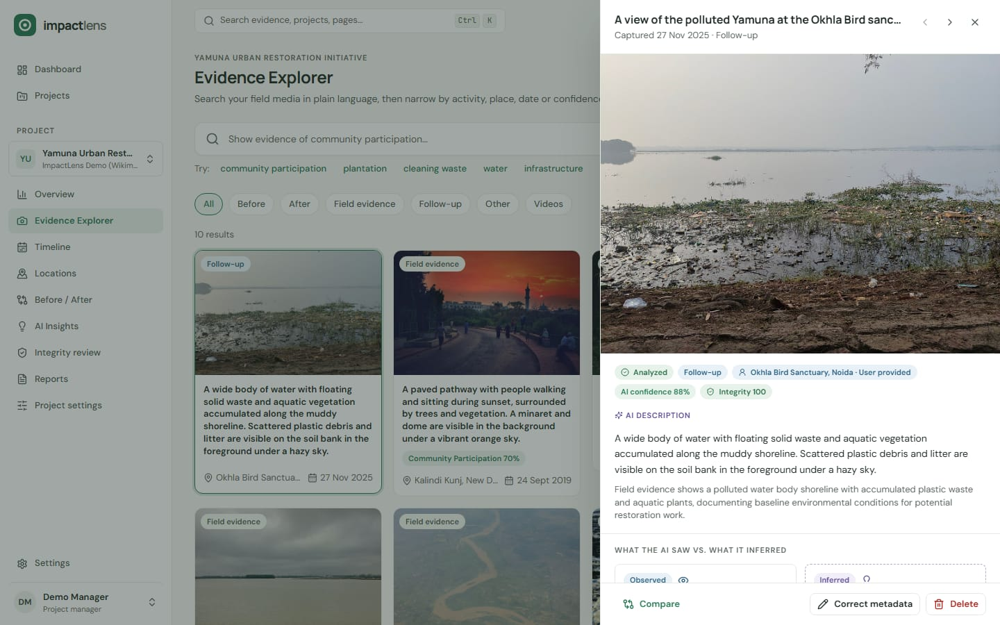
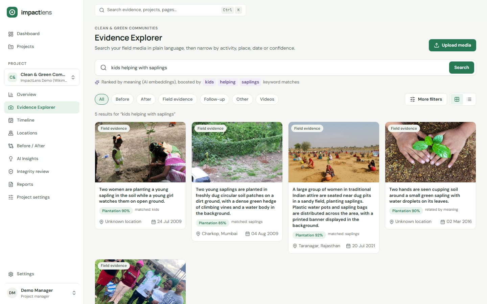
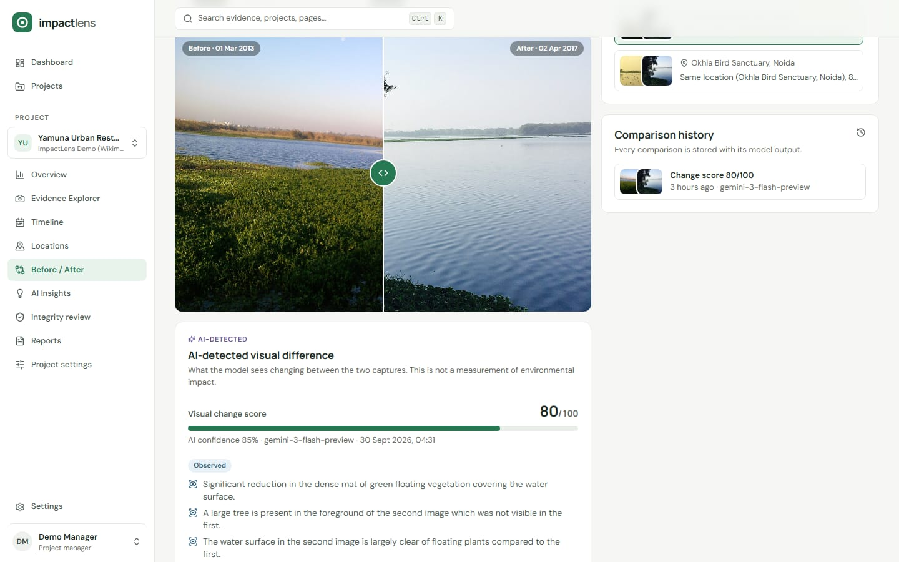
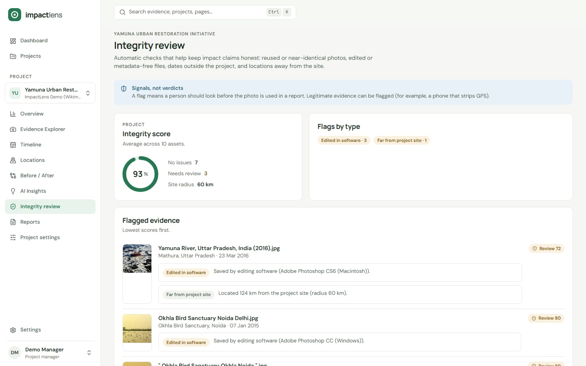
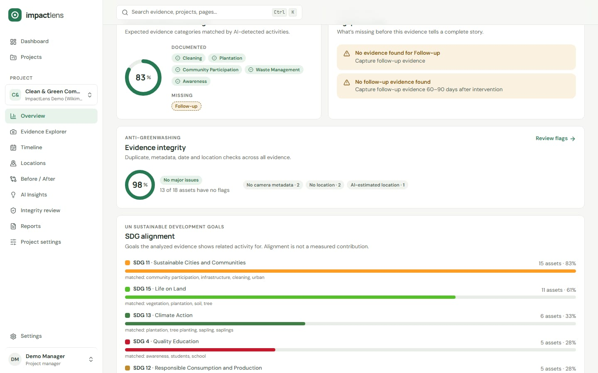
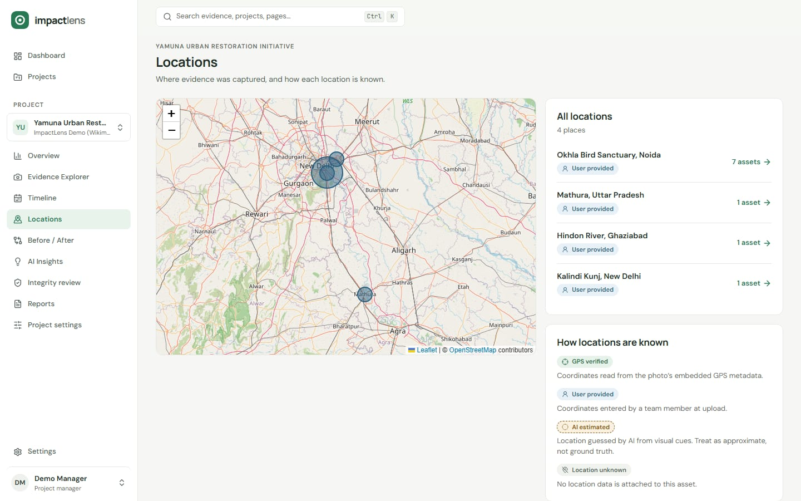
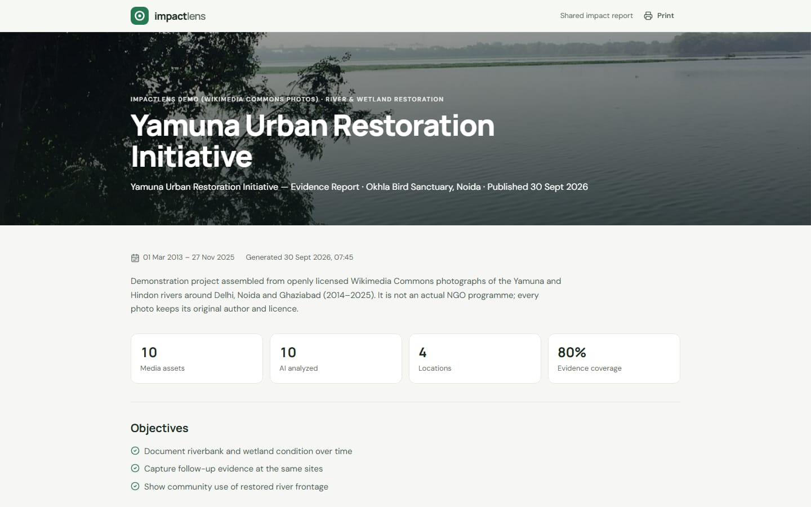
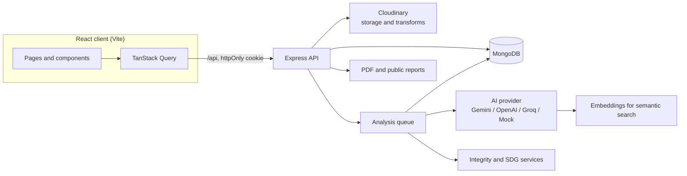

<div align="center">

# ImpactLens AI

### Turn raw field photos and videos into searchable, verifiable impact evidence.

ImpactLens helps NGOs, CSR teams and public agencies organise project media, understand it with AI, check it for integrity, and publish impact reports where every claim links back to its source.


[Features](#features) · [Architecture](#architecture) · [Getting started](#getting-started) · [API](#api-overview) · [Deployment](#deployment) · [Docs](#documentation)



</div>

---

## Table of contents

- [The problem](#the-problem)
- [How ImpactLens solves it](#how-impactlens-solves-it)
- [Features](#features)
- [Architecture](#architecture)
- [Tech stack](#tech-stack)
- [Getting started](#getting-started)
- [Configuration](#configuration)
- [Roles and permissions](#roles-and-permissions)
- [API overview](#api-overview)
- [Scripts](#scripts)
- [Testing and quality](#testing-and-quality)
- [Security](#security)
- [Deployment](#deployment)
- [Project structure](#project-structure)
- [Responsible AI](#responsible-ai)
- [Troubleshooting](#troubleshooting)
- [Documentation](#documentation)
- [Contributing](#contributing)
- [Team](#team)
- [Acknowledgements and license](#acknowledgements-and-license)

## The problem

Impact teams collect thousands of field photos, but those photos end up scattered across phones and shared drives with no context. At reporting time, someone scrolls for hours and picks the best-looking pictures. Nobody can say what was actually documented, what is missing, or whether a photo was reused from another project. Funders see the result as marketing rather than evidence.

## How ImpactLens solves it

ImpactLens treats every photo and video as **evidence** and runs it through four stages:

| Stage | What happens |
|---|---|
| **1. Understand** | Gemini describes each asset and separates what it *observed* from what it *inferred*, with calibrated confidence. |
| **2. Find** | Plain-language search ("kids helping with saplings") ranked by semantic embeddings, not just file names. |
| **3. Verify** | Integrity checks flag reused, edited or out-of-place media before it reaches a report. |
| **4. Report** | Reports, PDFs and public share pages trace every statement back to the media that supports it. |

## Features

| | |
|---|---|
| **AI media analysis**<br>Schema-constrained Gemini output: description, activities, objects, environmental signals and tags, each with its own confidence. Observed and inferred statements are kept apart, and confidence is capped at 95% so it never reads as proof. Videos are analysed as whole clips, with key frames extracted at 10%, 50% and 90% of the clip. |  |
| **Semantic evidence search**<br>Every asset is embedded with `gemini-embedding-001`. Queries are ranked by meaning and blended with keyword matches, and each result shows why it matched. Filters cover evidence type, activity, place, date and confidence. |  |
| **Before / after comparison**<br>Suggested pairs from the same site, an interactive slider, and an AI-detected change score with observed differences. With Cloudinary, a side-by-side composite image is generated for reports. |  |
| **Integrity review (anti-greenwashing)**<br>A SHA-256 hash and a perceptual dHash catch exact and near-duplicate reuse, including across projects. The checks also flag editing software, missing camera metadata, capture dates outside the project window, and GPS beyond the site radius. Every asset gets a 0–100 score. Flags are signals for human review, not verdicts. |  |
| **UN SDG alignment**<br>A transparent rules table maps AI-detected activities and signals to the Sustainable Development Goals and records the matched terms. The results are worded as alignment, never as a measured contribution. |  |
| **Timeline, map and coverage**<br>Evidence is grouped by month and plotted on a map. Each location is labelled by how it's known: GPS-verified, user-provided or AI-estimated. Coverage tracks the expected evidence categories and suggests what to capture next. |  |
| **Traceable reports**<br>Reports are generated from the evidence database: KPIs, coverage, insights, integrity, SDGs and an AI-written story and campaign copy. They export to PDF, or publish as a sanitised public page with a random share link. |  |

**Also included**

- Role-based access for admins, project managers and read-only viewers
- `Ctrl+K` command palette for jumping between projects and pages
- Live capture context on sign-in and upload (device location and local time)
- Loading, empty and error states throughout, and a responsive layout from phone to desktop
- Core pages checked against WCAG 2 A/AA with axe

## Architecture



### Upload pipeline

1. The file signature (magic bytes) is checked, not just the extension.
2. The file is stored in Cloudinary, which returns EXIF and a perceptual hash. Storage falls back to local disk when Cloudinary isn't configured.
3. SHA-256, dHash and camera metadata are recorded for integrity checks.
4. The asset is queued as `PENDING` and analysed by the configured AI provider (`PROCESSING`).
5. Its embedding is stored and it moves to `COMPLETED`.

Failures keep the asset, mark it `FAILED` and can be retried from the UI. The Gemini provider paces requests, rotates across a model pool, and parks models that hit their daily quota, so free-tier keys degrade gracefully instead of failing a whole batch.

### Pluggable AI providers

All AI calls go through one provider interface (`analyzeImage`, `compareImages`, `generateSummary`, `generateEmbedding`). Gemini is the primary provider; OpenAI, OpenRouter and Groq adapters are available, and an offline **mock provider** makes the whole app runnable without any API keys.

More detail: [architecture](docs/architecture.md) · [AI pipeline](docs/ai-pipeline.md) · [API reference](docs/api.md) · [OpenAPI spec](docs/openapi.yaml)

## Tech stack

| Layer | Technology |
|---|---|
| **Frontend** | React 18, TypeScript, Vite 6, Tailwind CSS v4, TanStack Query v5, Zustand, React Router, React Hook Form + Zod, Radix UI, Leaflet, cmdk |
| **Backend** | Node.js 20, Express 4, Mongoose 8, Multer, Sharp, PDFKit, Pino, Helmet, express-validator |
| **AI** | Google Gemini (vision, video, text), `gemini-embedding-001`; OpenAI, OpenRouter and Groq adapters; offline mock provider |
| **Media** | Cloudinary (EXIF, phash, `g_auto` thumbnails, video frames, composites) with local-disk fallback |
| **Testing** | Jest + Supertest + mongodb-memory-server, Vitest + Testing Library + MSW, Playwright + axe-core |
| **Delivery** | GitHub Actions CI, Render (API), Vercel (client), MongoDB Atlas, Docker |

## Getting started

### Prerequisites

- Node.js 20+ and npm
- MongoDB, either local or [Atlas](https://www.mongodb.com/atlas)
- Optional: a [Gemini API key](https://aistudio.google.com/apikey) and a [Cloudinary](https://cloudinary.com) account. Without them the app runs in offline mock mode.

### 1. Install

```bash
git clone https://github.com/Chirag240105/ImpactLens-AI.git
cd ImpactLens-AI
npm install            # installs the client and server workspaces
cp .env.example .env   # then set MONGODB_URI, JWT_SECRET and any optional keys
```

### 2. Load demo data

```bash
cd server
npm run seed:real      # 28 openly licensed field photos, analysed with your AI provider
# or
npm run seed           # synthetic offline fixture (no API keys needed)
```

### 3. Run

```bash
# terminal 1: API on http://localhost:5000
npm run dev:server

# terminal 2: web app on http://localhost:3000 (proxies /api to :5000)
npm run dev:client
```

Open <http://localhost:3000> and sign in with one of the seeded accounts:

| Role | Email | Password |
|---|---|---|
| Project manager | `manager@impactlens.demo` | `Manager123!` |
| Admin | `admin@impactlens.demo` | `Admin123!` |
| Viewer (read-only) | `viewer@impactlens.demo` | `Viewer123!` |

> [!WARNING]
> These are demo credentials. Change them, and set a strong `JWT_SECRET`, before sharing any deployment.

A scripted walkthrough of the demo is in [docs/demo-script.md](docs/demo-script.md).

## Configuration

All settings live in a single `.env` at the repository root. See [`.env.example`](.env.example) for the full, commented list.

| Variable | Purpose |
|---|---|
| `MONGODB_URI` | **Required.** MongoDB connection string |
| `JWT_SECRET` | **Required.** Session signing secret; use a long random value |
| `GEMINI_API_KEY` | Enables Gemini analysis, comparison, stories and semantic search |
| `AI_PROVIDER` | `gemini`, `openai`, `groq` or `mock` (falls back to `mock` when no key is present) |
| `GEMINI_MODEL`, `GEMINI_MODELS`, `GEMINI_RPM` | Primary model, optional model pool and request pacing for free-tier keys |
| `EMBEDDING_MODEL` | Embedding model for semantic search (default `gemini-embedding-001`) |
| `CLOUDINARY_CLOUD_NAME` / `_API_KEY` / `_API_SECRET` | Media storage and transforms. The cloud name is the lowercase ID on the Cloudinary dashboard |
| `CLOUDINARY_MODE` | `auto` (default) or `mock` to force local placeholder media |
| `UPLOADS_DIR` | Local media folder used when Cloudinary isn't configured |
| `CLIENT_URL`, `PUBLIC_REPORT_BASE_URL` | Allowed browser origin and public share-link base |
| `COOKIE_SAMESITE`, `SESSION_MAX_AGE_MS`, `TRUST_PROXY` | Cookie policy, session length and proxy hops for hosted deployments |
| `MAX_UPLOAD_MB`, `RATE_LIMIT_WINDOW_MS`, `RATE_LIMIT_MAX`, `RATE_LIMIT_ACTION_MAX` | Upload size and rate limits |

`GET /api/health` and **Settings → Service status** in the app show which services are connected.

## Roles and permissions

| Capability | Admin | Project manager | Viewer |
|---|:---:|:---:|:---:|
| Browse projects, evidence, timeline, map, integrity and reports | ✅ | ✅ | ✅ |
| Search evidence and export report PDFs | ✅ | ✅ | ✅ |
| Create, edit and delete projects | ✅ | ✅ | — |
| Upload, edit, delete and re-analyse media | ✅ | ✅ | — |
| Generate insights, stories, campaigns and reports | ✅ | ✅ | — |
| Publish reports to a public share link | ✅ | ✅ | — |

Roles are enforced on the server for every write route; the client hides actions a user can't take.

## API overview

All endpoints are served under `/api`. Authenticated routes accept the session cookie set at sign-in. The full contract is in [docs/api.md](docs/api.md) and [docs/openapi.yaml](docs/openapi.yaml), and a ready-made [Postman collection](docs/impactlens.postman_collection.json) is included.

| Area | Endpoints |
|---|---|
| **Health** | `GET /health` |
| **Auth** | `POST /auth/register` · `POST /auth/login` · `GET /auth/me` · `POST /auth/logout` |
| **Projects** | `GET, POST /projects` · `GET, PATCH, DELETE /projects/:id` · `POST /projects/:id/analyze` · `GET /projects/:id/processing-status` |
| **Project intelligence** | `GET /projects/:id/{dashboard, timeline, locations, coverage, integrity, sdgs, comparisons, pair-suggestions, insights, reports}` · `POST /projects/:id/insights/generate` |
| **Media** | `POST /media/upload` · `POST /media/sign` · `GET /media` · `GET, PATCH, DELETE /media/:id` · `POST /media/:id/analyze` |
| **Search and analysis** | `GET /search` · `/analysis/*` (before/after comparison) · `/insights/*` (evidence traceability) |
| **Reports** | `POST /reports/generate` · `POST /reports/story` · `POST /reports/campaign` · `GET /reports/:id` · `GET /reports/:id/pdf` · `PATCH /reports/:id/publish` |
| **Public** | `GET /reports/public/:slug` (no sign-in required) |
| **Dashboard** | `GET /dashboard/overview` |

## Scripts

Run from the repository root:

| Command | Description |
|---|---|
| `npm run dev:server` / `npm run dev:client` | Start the API / web app in development mode |
| `npm run build` | Type-check and build the client for production |
| `npm test` / `npm run test:coverage` | Run the API test suite / with coverage |

Run inside a workspace:

| Where | Command | Description |
|---|---|---|
| `server/` | `npm start` | Start the API in production mode |
| `server/` | `npm run seed:real` / `npm run seed:real:reset` | Import (or reset and re-import) the real demo dataset; add `-- --reanalyze` to re-run AI on every photo |
| `server/` | `npm run seed` / `npm run seed:reset` | Load or reset the synthetic fixture |
| `server/` | `npm run lint` / `npm run smoke` | ESLint / end-to-end API smoke check |
| `client/` | `npm run typecheck` / `npm run lint` | TypeScript and ESLint checks |
| `client/` | `npm test` / `npm run test:e2e` | Unit tests / Playwright E2E with accessibility checks |

## Testing and quality

| Suite | Tooling | Coverage |
|---|---|---|
| **API** | Jest, Supertest, mongodb-memory-server | Auth, RBAC, uploads, search, integrity scoring, SDG alignment, reports, public sharing, and the Gemini provider's retry and quota handling |
| **Client** | Vitest, Testing Library, MSW | Forms, the auth store, evidence components, integrity and SDG views |
| **End to end** | Playwright, axe-core | Sign-in → upload → search → compare → report → public link, the read-only viewer workspace, device location, and a smoke spec checking core pages for layout overflow and WCAG 2 A/AA violations |

```bash
npm test                                   # API
cd client && npm test && npm run test:e2e  # client unit + E2E
```

**Continuous integration.** Two GitHub Actions pipelines run on pushes and pull requests that touch their code ([`.github/workflows`](.github/workflows)):

- **Client:** lint, type-check, unit tests, production build and the Playwright E2E suite
- **Server:** lint and the Jest suite with coverage

## Security

- **Sessions:** JWTs in `httpOnly` cookies, plus a header check that blocks cross-site form writes (CSRF)
- **Passwords:** hashed with bcrypt; auth routes have a stricter rate limit
- **Input:** `express-validator` on mutating routes and `express-mongo-sanitize` against operator injection
- **Uploads:** size limits and file-signature (magic byte) validation before anything is stored
- **Transport and headers:** Helmet security headers and a strict CORS allow-list with credentials
- **Abuse protection:** general, auth and AI-action rate limits, all configurable
- **Secrets:** API keys stay server-side; the client never receives Cloudinary or AI credentials
- **Public reports:** published pages are sanitised and served from unguessable random slugs

## Deployment

The recommended free-tier setup is **MongoDB Atlas → Render (API) → Vercel (client)**:

| Piece | Provided config |
|---|---|
| API on Render | [`render.yaml`](render.yaml) blueprint |
| Client on Vercel | [`client/vercel.json`](client/vercel.json), which proxies `/api` so the session cookie stays same-site |
| Container | [`server/Dockerfile`](server/Dockerfile) and [`server/docker-compose.yml`](server/docker-compose.yml) |

The step-by-step guide, including the environment variables each service needs, is in [docs/deployment.md](docs/deployment.md).

## Project structure

```
ImpactLens-AI/
├── client/                 React + TypeScript SPA
│   ├── src/api/            typed endpoints, query keys, queries and mutations
│   ├── src/components/     UI kit, evidence, report and chart components
│   ├── src/pages/          dashboard, projects, evidence, compare, integrity, reports
│   └── e2e/                Playwright specs
├── server/                 Express API
│   ├── routes/ controllers/ middleware/ models/
│   ├── services/           ai, cloudinary, integrity, sdg, search, report
│   ├── jobs/               media analysis queue
│   ├── utils/              seeders, EXIF, smoke test
│   └── tests/              Jest suites
├── shared/                 enums and SDG rules shared by client and server
├── docs/                   architecture, API, AI pipeline, deployment, demo script
├── render.yaml             Render blueprint for the API
└── DESIGN.md               design system and tokens
```

## Responsible AI

ImpactLens is built so that AI output supports human judgement instead of replacing it.

- **Observed vs inferred.** *Observed* is only what is visible. *Inferred* is interpretation, phrased as "may" or "likely". Claimed outcomes come from human project records, never from the model.
- **Confidence is labelled, not hidden.** Every AI value shows its confidence and model, and confidence is capped below certainty.
- **Location provenance.** AI-estimated places never override GPS or user-entered locations, and each location is labelled by its source.
- **Human review.** Integrity flags and AI comparisons are shown as "AI-detected" signals. Reports carry a verification disclaimer, because visual AI alone does not prove real-world impact.
- **Traceability.** Each report statement links to its source media, the stored asset, the AI model that produced it, and when.

## Troubleshooting

| Symptom | Fix |
|---|---|
| Assets stay `FAILED` with a quota error | Free Gemini keys allow a small number of requests per model per day. Add more models to `GEMINI_MODELS`, lower `GEMINI_RPM`, or retry the next day. The rest of the app keeps working. |
| Cloudinary uploads are rejected | Use the lowercase **cloud name** from the Cloudinary dashboard, not the account's display name. |
| No AI output at all | Check **Settings → Service status**. With no key set, `AI_PROVIDER` falls back to the offline mock. |
| Signed out immediately on a hosted deployment | Serve the client and API from the same site (the Vercel proxy does this), or set `COOKIE_SAMESITE=none` over HTTPS and configure `TRUST_PROXY`. |
| CORS errors in the browser | `CLIENT_URL` must exactly match the web app's origin, including the scheme. |

## Documentation

| Document | Contents |
|---|---|
| [docs/architecture.md](docs/architecture.md) | Backend architecture, data model and services |
| [docs/ai-pipeline.md](docs/ai-pipeline.md) | Upload and storage, providers, video, semantic search, integrity, SDGs and trust rules |
| [docs/api.md](docs/api.md) · [docs/openapi.yaml](docs/openapi.yaml) | REST API reference and OpenAPI spec |
| [docs/deployment.md](docs/deployment.md) | Atlas, Render, Vercel and Docker setup |
| [docs/demo-script.md](docs/demo-script.md) | Guided product walkthrough |
| [DESIGN.md](DESIGN.md) | Design system, tokens and UI guidelines |

## Contributing

1. Create a feature branch from `developing`.
2. Keep changes focused, and add or update tests alongside the code.
3. Run `npm run lint` and the relevant test suites in `client/` and `server/` before pushing.
4. Open a pull request with a short description and, for UI changes, a screenshot. CI must pass before merge.

Never commit `.env` or real credentials; add new settings to `.env.example` instead.

## Team

| Member | Focus |
|---|---|
| **Chirag** | Backend architecture, AI integration |
| **Charanjeet** | Frontend, UX and design system |
| **Avani Sharma** | Media intelligence, timeline, analysis jobs |
| **Atharv** | Reports, testing, deployment and docs |

## Acknowledgements and license

The real demo dataset is 28 photographs from [Wikimedia Commons](https://commons.wikimedia.org), used under their Creative Commons licences. Each asset stores its author, licence and source link, and these are shown in the evidence panel. The demo projects are illustrations built from public photos; they are not real NGO programmes.

ImpactLens is released under the MIT License.
