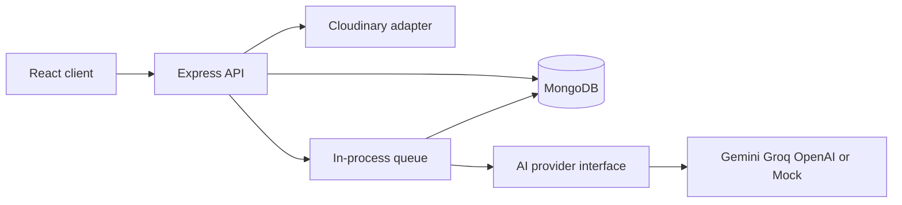

# Backend architecture

Express 4 CommonJS app. API route files are grouped by domain under `server/routes/` (`auth`, `projects`, `media`, `insights`/analysis, and `reports`); `routes/index.js` mounts them under `/api`. Shared auth, role, validation, and error middleware stays in `server/middleware/`. AI and Cloudinary integrations are adapters under `server/services/ai/` and `server/services/cloudinary/`. Mongoose schemas live in `server/models/`. `server/app.js` exports an app for tests; `server/server.js` connects MongoDB, recovers pending work, listens, and closes HTTP/Mongo on signals.

When adding an API feature, add its route file under `server/routes/`, keep HTTP input/output handling in a controller, put business rules and persistence coordination in a service, and add schema/provider code only in its own layer. Register the router in `routes/index.js`. Keep feature logic out of route files.

Express 4 CommonJS app. Dependencies flow routes → controllers → services → models and external adapters. Mongoose owns persistence. `server/app.js` exports an app for tests; `server/server.js` connects MongoDB, recovers pending work, listens, and closes HTTP/Mongo on signals.

Media location is stored as named latitude/longitude fields, not GeoJSON; no 2dsphere index is claimed. Project deletion archives the project so evidence records and source traces remain intact. The in-process queue limits concurrency to two and recovers pending/processing documents at boot; it is not a durable distributed queue. `secureUrl` is omitted from media lists.

See [API](api.md), [AI pipeline](ai-pipeline.md), and [deployment](deployment.md). Real Cloudinary / provider calls and PDF export still need production verification.
